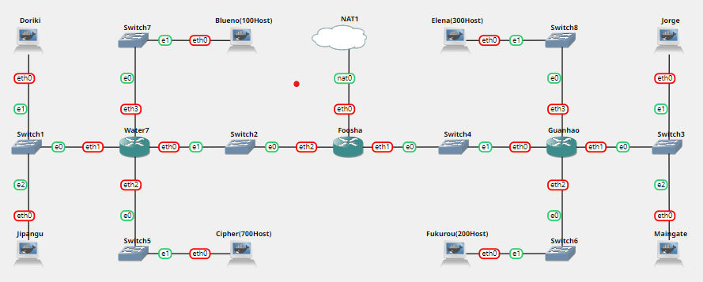
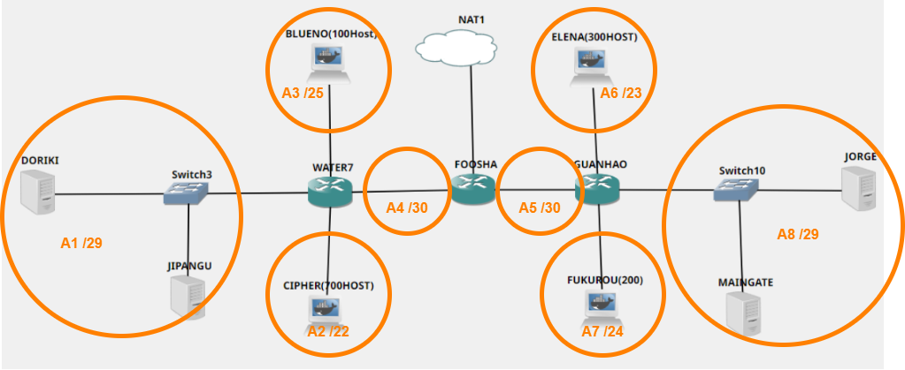
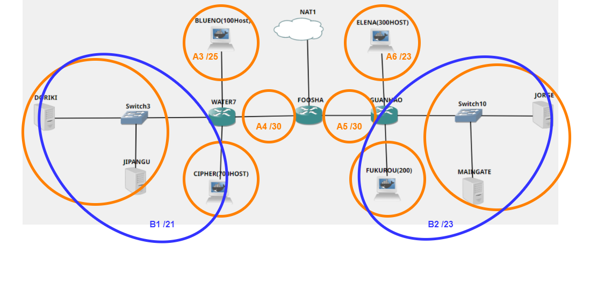
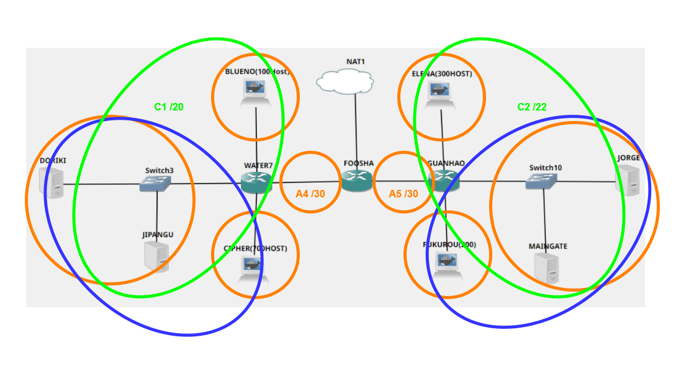
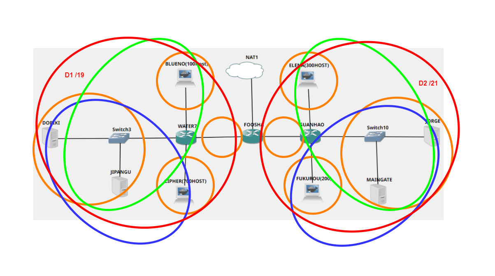
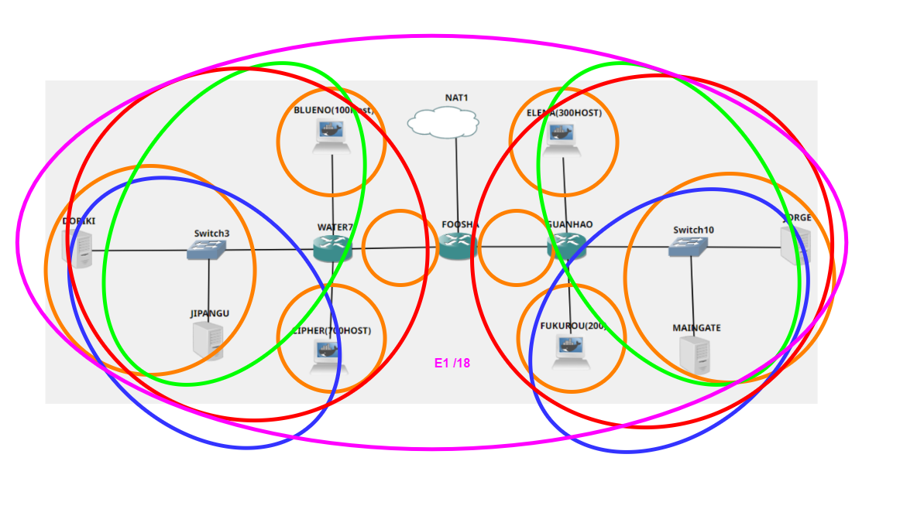
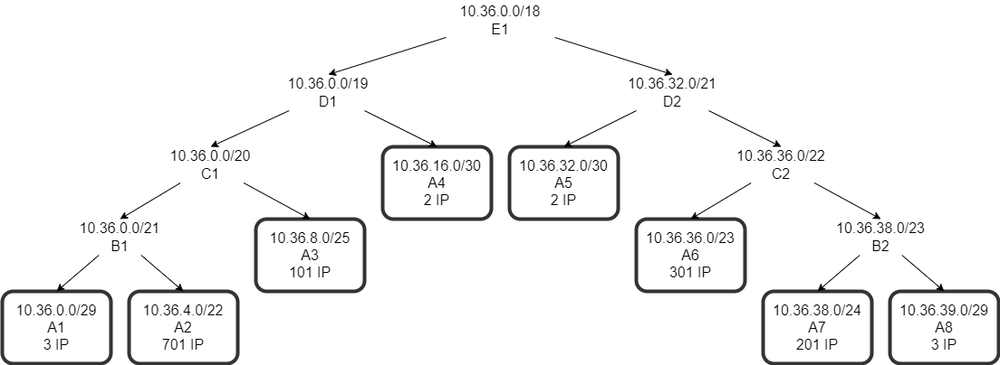
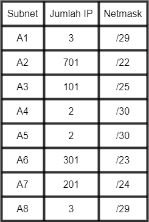

# Jarkom-Modul-5-E14-2021

Laporan Resmi Modul 5 Jaringan Komputer E-14

**Anggota kelompok**:

- Dwi Wahyu Santoso (05111840000121)
- Khaela Fortunela (05111940000057)
- Husin Muhammad Assegaff (05111940000127)

---

## Tabel Konten

A. Topologi

- [Topologi](#topologi)
- [CIDR](#c-cidr-pada-gns3)
  - [1. CIDR Subnetting](#1-cidr-subnetting)
  - [2. CIDR Routing](#2-cidr-routing)

B. Jawaban

- [Soal 1](#soal-1)
- [Soal 2](#soal-2)
- [Soal 3](#soal-3)
- [Soal 4](#soal-4)
- [Soal 5](#soal-5)
- [Soal 6](#soal-6)

C. Kendala

- [Kendala](#kendala)

---

## Topologi

Pembagian IP menggunakan Prefix IP yang telah ditentukan pada modul pengenalan. Prefix IP Address kelompok E14 kami adalah `10.36`.


Keterangan :

- Doriki adalah DNS Server
- Jipangu adalah DHCP Server
- Maingate dan Jorge adalah Web Server
- Jumlah Host pada Blueno adalah 100 host
- Jumlah Host pada Cipher adalah 700 host
- Jumlah Host pada Elena adalah 300 host
- Jumlah Host pada Fukurou adalah 200 host

## CIDR

### 1. CIDR Subnetting

Berikut untuk proses pembagian subnet dari terkecil hingga terbesar






Dari pembagian subnet tersebut, didapatkan hasil pembagian IP pada setiap subnet sebagai berikut,





Setting interfaces pada masing masing node sebagai berikut
- Foosha
```
auto lo
iface lo inet loopback

auto eth0
iface eth0 inet dhcp

auto eth1
iface eth1 inet static
address 10.36.32.1
netmask 255.255.255.252

auto eth2
iface eth2 inet static
address 10.36.16.1
netmask 255.255.255.252
```
- Water7
```
auto lo
iface lo inet loopback

auto eth0
iface eth0 inet static
address 10.36.16.2
netmask 255.255.255.252
gateway 10.36.16.1

auto eth1
iface eth1 inet static
address 10.36.0.1
netmask 255.255.255.248

auto eth2
iface eth2 inet static
address 10.36.4.1
netmask 255.255.252.0

auto eth3
iface eth3 inet static
address 10.36.8.1
netmask 255.255.255.128
```
- Guanhao
```
auto lo
iface lo inet loopback

auto eth0
iface eth0 inet static
address 10.36.32.2
netmask 255.255.255.252
gateway 10.36.32.1

auto eth1
iface eth1 inet static
address 10.36.39.1
netmask 255.255.255.248

auto eth2
iface eth2 inet static
address 10.36.38.1
netmask 255.255.255.0

auto eth3
iface eth3 inet static
address 10.36.36.1
netmask 255.255.254.0
```
- Doriki
```
auto lo
iface lo inet loopback

auto eth0
iface eth0 inet static
address 10.36.0.2
netmask 255.255.255.248
gateway 10.36.0.1
```
- Jipangu
```
auto lo
iface lo inet loopback

auto eth0
iface eth0 inet static
address 10.36.0.3
netmask 255.255.255.248
gateway 10.36.0.1
```
- Jorge
```
auto lo
iface lo inet loopback

auto eth0
iface eth0 inet static
address 10.36.39.2
netmask 255.255.255.248
gateway 10.36.39.1
```
- Maingate
```
auto lo
iface lo inet loopback

auto eth0
iface eth0 inet static
address 10.36.39.3
netmask 255.255.255.248
gateway 10.36.39.1
```
- Clients
```
auto lo
iface lo inet loopback

auto eth0
iface eth0 inet dhcp
```
Setting route pada router sebagai berikut:
- Foosha
```
route add -net 10.36.0.0 netmask 255.255.255.248 gw 10.36.16.2	#A1
route add -net 10.36.4.0 netmask 255.255.252.0 gw 10.36.16.2	#A2
route add -net 10.36.8.0 netmask 255.255.255.128 gw 10.36.16.2	#A3
route add -net 10.36.36.0 netmask 255.255.254.0 gw 10.36.32.2	#A6
route add -net 10.36.38.0 netmask 255.255.255.0 gw 10.36.32.2	#A7
route add -net 10.36.39.0 netmask 255.255.255.248 gw 10.36.32.2	#A8
```
- Water7
```
route add -net 0.0.0.0 netmask 0.0.0.0 gw 10.36.16.1
```
- Guanhao
```
route add -net 0.0.0.0 netmask 0.0.0.0 gw 10.36.32.1
```

### 2. CIDR Routing

## Soal 1

Agar topologi yang kalian buat dapat mengakses keluar, kalian diminta untuk mengkonfigurasi Foosha menggunakan iptables, tetapi Luffy tidak ingin menggunakan MASQUERADE.

**Pembahasan:**

Karena tidak diperbolehkan menggunakan MASQUERADE maka rule iptables dengan MASQUERADE di drop.

```
iptables -t nat -D POSTROUTING -o eth0 -j MASQUERADE -s 10.36.0.0/16
```

Kemudian ditambahkan rule iptables yang baru.

```
iptables -t nat -A POSTROUTING -s 10.36.0.0/16 -o eth0 -j SNAT --to-source 192.168.122.186
```

Kemudian dilakukan testing node-node pada topologi dengan ping google.com, maka node-node sudah dapat mengakses keluar.

## Soal 2

Kalian diminta untuk mendrop semua akses HTTP dari luar Topologi kalian pada server yang merupakan DHCP Server dan DNS Server demi menjaga keamanan.

**Pembahasan:**

Pada router Foosha ditambahkan rule berikut.

```
iptables -A FORWARD -p tcp --dport 80 -d 10.36.0.0/29 -i eth0 -j DROP
```

Maka paket yang menuju port 80 (HTTP) akan didrop.

## Soal 3

Karena kelompok kalian maksimal terdiri dari 3 orang. Luffy meminta kalian untuk membatasi DHCP dan DNS Server hanya boleh menerima maksimal 3 koneksi ICMP secara bersamaan menggunakan iptables, selebihnya didrop.

**Pembahasan:**

Pada DHCP Server (Jipangu) dan DNS Server (Doriki) ditambahkan rule berikut.

```
iptables -A INPUT -p icmp -m connlimit --connlimit-above 3 --connlimit-mask 0 DROP
```

Ketika koneksi ICMP melebihi 3, maka perintah drop dilaksanakan.

## Soal 4

Akses dari subnet Blueno dan Cipher hanya diperbolehkan pada pukul 07.00 - 15.00 pada hari Senin sampai Kamis.

**Pembahasan:**

Pada DNS Server (Doriki) ditambahkan rule berikut.

```
iptables -A INPUT -s 10.36.4.0/22 -m time --timestart 07:00 --timestop 15:00 --weekdays Mon,Tue,Wed,Thu -j ACCEPT
iptables -A INPUT -s 10.36.8.0/25 -m time --timestart 07:00 --timestop 15:00 --weekdays Mon,Tue,Wed,Thu -j ACCEPT

iptables -A INPUT -s 10.36.4.0/22 -j REJECT
iptables -A INPUT -s 10.36.8.0/25 -j REJECT
```

Sehingga akses dari subnet Blueno dan Cipher dibatasi dari 07.00 sampai 15.00 di hari Senin-Kamis, dan selain waktu tersebut ditolak.

## Soal 5

Akses dari subnet Elena dan Fukuro hanya diperbolehkan pada pukul 15.01 hingga pukul 06.59 setiap harinya.

**Pembahasan:**
Pada DNS Server (Doriki) ditambahkan rule berikut.

```
iptables -A INPUT -s 10.36.36.0/23 -m time --timestart 00:00 --timestop 06:59 -j ACCEPT
iptables -A INPUT -s 10.36.36.0/23 -m time --timestart 15:01 --timestop 23:59 -j ACCEPT
iptables -A INPUT -s 10.36.38.0/24 -m time --timestart 00:00 --timestop 06:59 -j ACCEPT
iptables -A INPUT -s 10.36.38.0/24 -m time --timestart 15:01 --timestop 23:59 -j ACCEPT

iptables -A INPUT -s 10.36.36.0/23 -j REJECT
iptables -A INPUT -s 10.36.38.0/24 -j REJECT
```

Sehingga akses dari subnet Elena dan Fukuro dibatasi dari 00.00 sampai 06.59 dan dari 15.01 sampai 23.59, dan selain waktu tersebut ditolak.

## Soal 6

Karena kita memiliki 2 Web Server, Luffy ingin Guanhao disetting sehingga setiap request dari client yang mengakses DNS Server akan didistribusikan secara bergantian pada Jorge dan Maingate.

**Pembahasan:**

## Kendala
